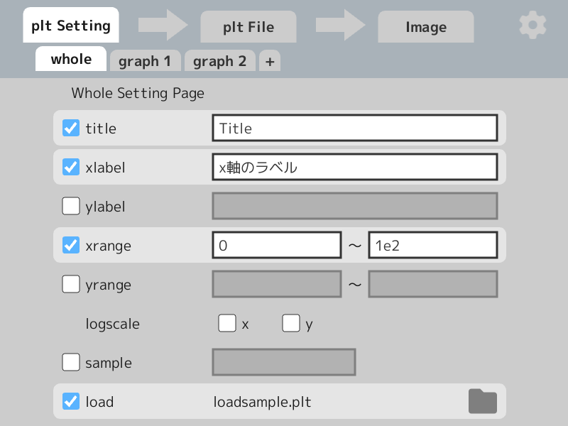
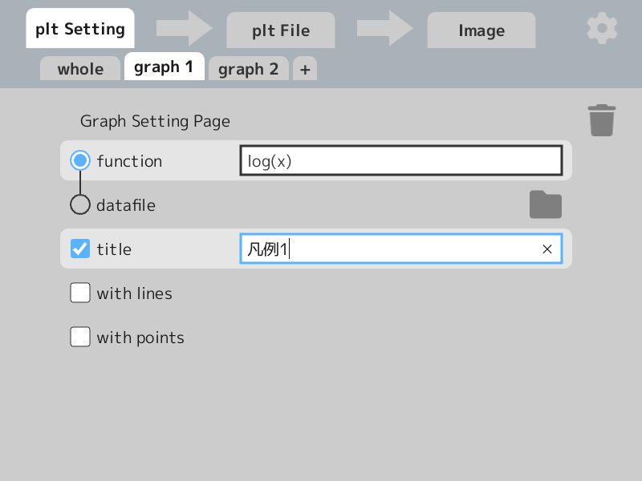
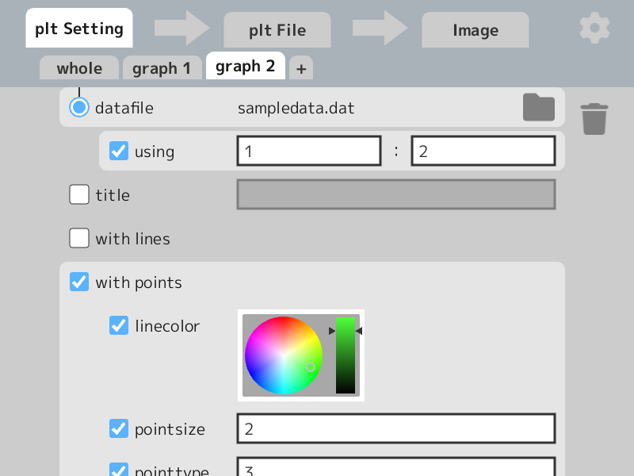
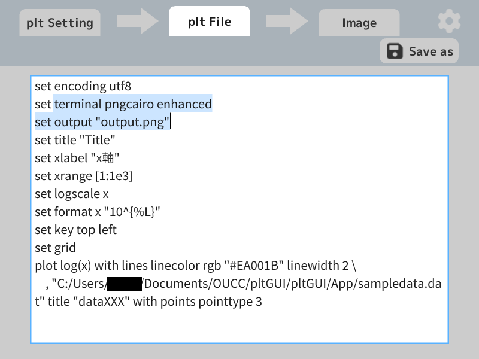
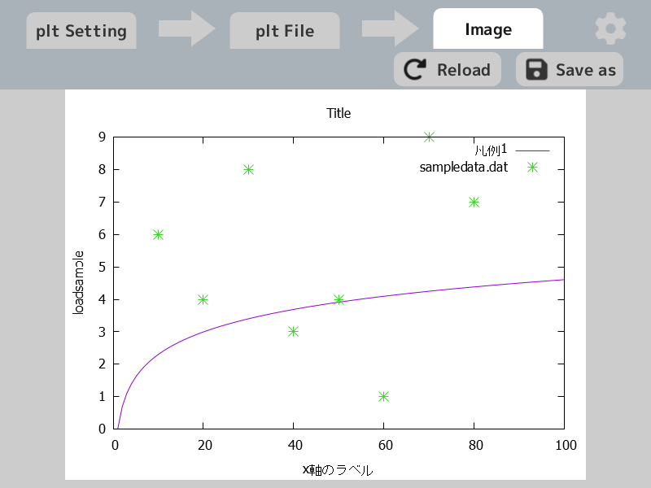

# pltGUI
gnuplotのpltファイルをGUIから作成できるツール

## 環境
gnuplot 5.4 patchlevel 6  
OpenSiv3D 0.6.6

## 使い方
0. https://github.com/OUCC/pltGUI/releases よりzipファイルをダウンロード、展開、`pltGUI.exe`を実行。
1. plt Settingのwhole,graphに入力していく。  
（複数のグラフを重ねて描写したいなら＋マークで増やす）
2. plt Settingからplt Fileへの矢印を押してpltファイルを生成。
3. plt Fileのタブをクリックして中身を確認、必要に応じて保存。
4. plt FileからImageへの矢印を押して画像を生成。
5. Imageから画像を確認、1.に戻って修正。
6. 気に入ったら保存。

## 画面構成

### スクショ
- plt Setting
    - whole  
    
    - graph1  
    
    - graph2  
    
- plt File  

- plt File  

### 説明

最上部に

- plt Setting
- 右矢印のアイコンボタン１
- plt File
- 右矢印のアイコンボタン２
- Image
- 歯車のアイコンボタン

のUIがある。  
**矢印のアイコンボタンはそれぞれ、plt Settingの入力からplt Fileの生成、plt Fileを実行して画像の生成をするボタン**。これを押さないと生成されない。押すと生成中のアニメーションが再生されるが、実行時間とは無関係。  
その他の項目（歯車含む）は切り替え式のタブで、中身は以下の通り。

- plt Setting  
詳細は後述
- plt File  
作成したpltファイル。  
この画面で編集することも可能。  
右上のSave asで保存できる。
- Image  
作成したpltファイルから生成したグラフの画像  
右上のSave asで保存できる。
- app options(歯車アイコン)  
テーマなどアプリの設定  
キーワードの省略（例：`linecolor`→`lc`）や、アプリのテーマカラーなどを指定できる

plt Settingのタブはその中にもタブを持つ。
- whole  
軸などの全体設定
- graph1  
それぞれのグラフの設定
- ＋  
グラフの数を増やす。複数のグラフは重ねて描画される。削除は右のゴミ箱ボタン

whole,graph の中身は下記入力項目を参照。  
グラフの数が画面端に差し掛かる場合、マウスホイールで左右にスクロールできる。

**注意**：データファイルを指定して描画する場合、生成されるplt Fileでは絶対パスで書かれるため、ユーザー名の流出などに注意。

### 入力項目
チェックなしは今後追加したいもの。  
`vX.X.X`は追加されたバージョン、無表記は`v1.0.0`。

- plt setting
    - whole
        - title
        - xrange, yrange
        - logscale x, y
        - sample
        - xlabel, ylabel
        - load `v1.1.0`
    - graph
        - 削除ボタン
        - plot (function)
        - plot "datafile" 
			- using x:y
        - title
        - with lines
            - linecolor
            - linetype
            - linewidth
        - with points
            - linecolor
            - pointtype
            - pointsize
        
        ※with linesとwith pointsは同時に指定できる（with linespoints）  
        また、linecolorはwith pointsとwith linesで共通のため、両方に存在するが中身は同じ。
- plt file
    - save as
- image
    - reload
    - save as
- app options
    - ライセンスの表示
    - pltファイルでの色の指定がrgbかhsvか
    - キーワードの省略(部分的)
    - アプリのテーマカラーの指定（Base,Main,Accent）(サポート終了)
- その他
    - (plt setting -> plt file)のボタン
    - (plt file -> image)のボタン

## 今後の予定
要望があれば積極的に取り入れます。  
上のやつからやるつもり。
- 凡例の有無と位置の調整
- グリッド
- logscaleの指数表記
- UI周りのコードの整理
- カラーテピッカーのスペース改善
- 矢印ボタンを右クリックでplt生成と画像生成を自動で続けて行う
- 入力欄に大量の文字を入れるとはみ出る対策
- データファイルのドラッグ＆ドロップ
- カラーテーマの完全削除
- アプリの大きさを変えられるようにする
- with linesとかの開くやつの閉じる機能
- フォント指定
- 複数pltファイル読み込み
- グルーピング機能
- ドキュメント作成...要る？
- splot

## 更新履歴  
#### v1.1.0 2023-04-30
Siv3Dバージョンアップ (v0.6.6 → v0.6.9)  
pltファイルを編集可能に  
pltファイルの実行を公式機能で行えるように  
ライセンス更新  
plt Filesのreloadを削除  
Save asの拡張子選択でAll Filesを選択可能に  
カラーテーマ変更機能のサポート終了(今回以降追加の機能にカラーテーマは適用されない)  

#### v1.0.0 2023-04-13
初リリース  
内容は省略  