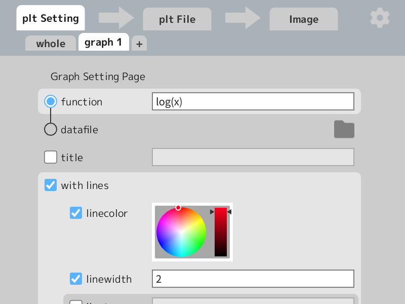
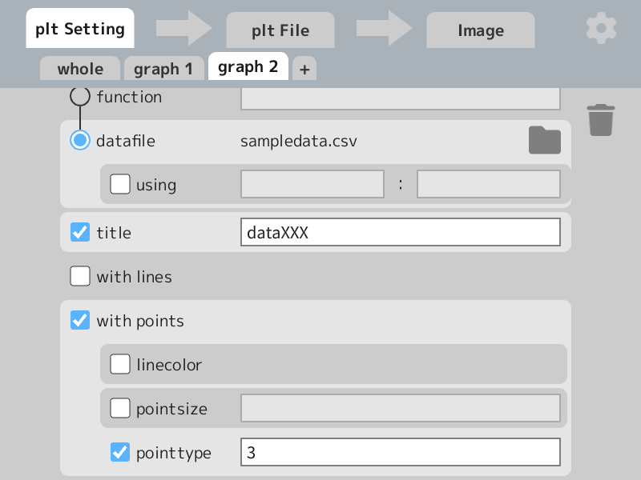
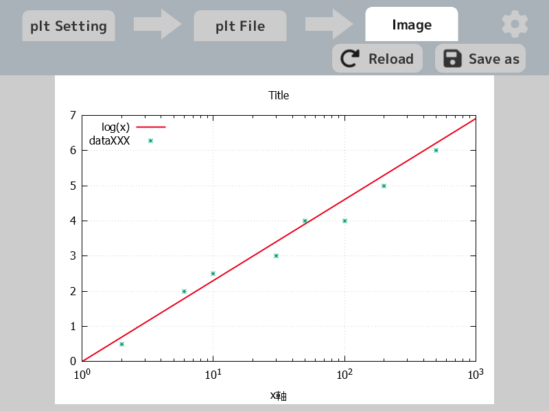

# pltGUI
gnuplotのpltファイルをGUIから作成できるツール

## 環境
gnuplot 5.4 patchlevel 6
OpenSiv3D 0.6.6

## 画面構成

### スクショ
- plt Setting
    - whole
    
    - graph1
    
    - graph2
    
    - graph3
    
- plt File

- plt File

- app options

### 説明

最上部に

- plt Setting
- 右矢印のアイコンボタン１
- plt File
- 右矢印のアイコンボタン２
- Image
- 歯車のアイコンボタン

のUIがある。
矢印のアイコンボタンはそれぞれ、plt Settingの入力からplt Fileの生成、plt Fileを実行して画像の生成をするボタン。押すと生成中のアニメーションが再生されるが、実行時間とは無関係。
その他の項目（歯車含む）は切り替え式のタブで、中身は以下の通り。

- plt Setting
    - whole (軸などの全体設定)
    - graph1(それぞれのグラフの設定)
    - ＋ (グラフの数を増やす。重ねて描画される。削除は右のゴミ箱ボタン)
- plt File
作成したpltファイル
右上のSave asで保存できる。
- Image
作成したpltファイルから生成したグラフの画像
右上のSave asで保存できる。
- app options(歯車アイコン)
テーマなどアプリの設定
キーワードの省略（例：`linecolor`→`lc`）や、アプリのテーマカラーなどを指定できる

### 入力項目
チェックなしは今後追加したいもの

- plt setting
    - whole
        - [x] title
        - [x] xrange, yrange
        - [x] logscale x, y
        - [x] sample
        - [x] xlabel, ylabel
    - graph
        - [x] 削除ボタン
        - [x] plot
        - [x] plot "datafile" 
			- [x] using x:y
        - [ ] splot
        - [x] title
        - [x] withlines
            - [x] linecolor
            - [x] linetype
            - [x] linewidth
        - [x] withpoints
            - [x] linecolor
            - [x] pointtype
            - [x] pointsize
- plt file
    - [x] reload
    - [x] save as
- image
    - [x] reload
    - [x] save as
- app options
    - [x] pltファイルでの色の指定がrgbかhsvか
    - [x] キーワードの省略
- その他UI
    - [x] (plt setting -> plt file)のボタン
    - [x] (plt file -> image)のボタン
    - [x] optionsのタブをアイコンに
    - [x] チェック範囲拡大でつけやすく
    - [x] スクロールの範囲
    - [x] タブ部分と重なったときのクリック排除
    - [ ] データファイルのドラッグ＆ドロップ
    - [ ] 拡張子の設定
    - [ ] plt Fileの編集、スクロール

